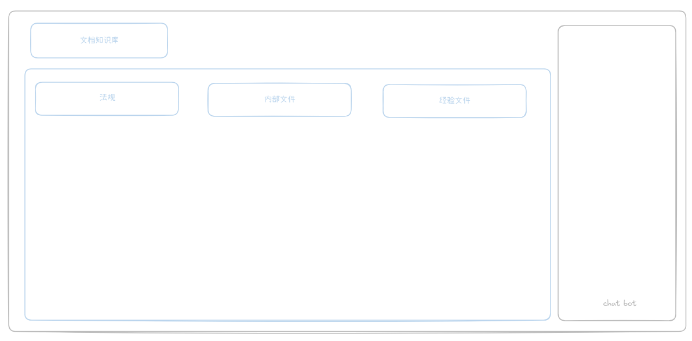
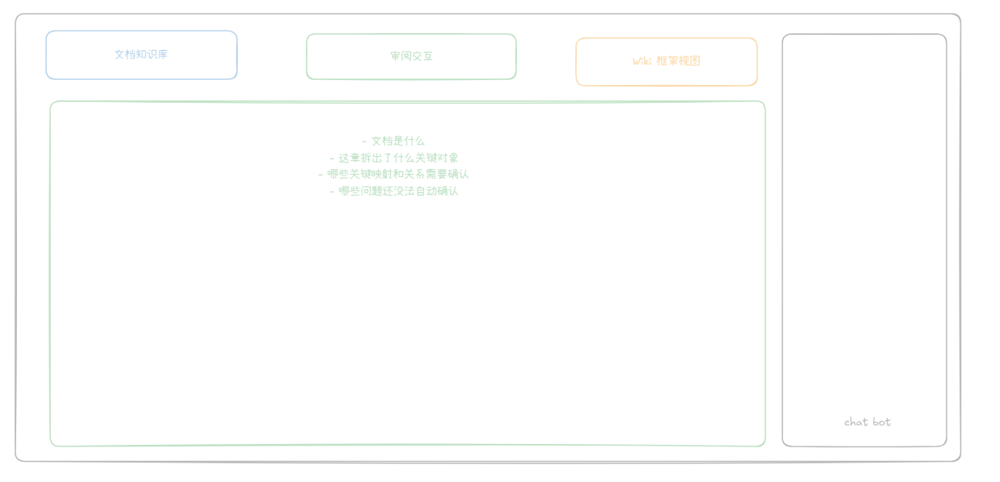
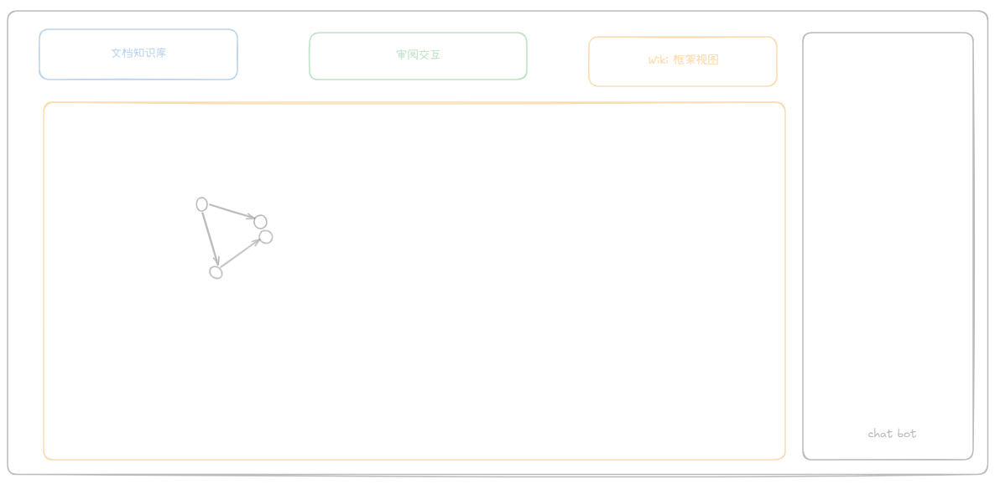

# QT Wiki 首次上传设计

## 1. 这份设计要解决什么

这份设计在讲：

当用户第一次上传法规、法规解读、内部 PEP、SOP、模板、培训材料时，QT Wiki 应该先怎么拆知识、怎么做判断、哪些地方必须让人拍板，最后再把批准后的内容写进 wiki。

如果这个入口做对了，后面才有可能稳定支撑三类事情：

- 用户提问时，AI 能结合 raw 数据、企业内部材料和外部法规给出完整指导，并带 reference。
- 系统能给出一对多映射，例如一条法规要求对应多个内部步骤、模板和记录。
- 后续可以基于已审批的结果输出 slides，而不是每次都重新从原始 PDF 临时总结。

## 2. 一句话框架

QT Wiki 的首次上传，不应该是“直接生成 wiki 页面”，而应该是：

AI 先把知识拆出来，人工只审核关键判断，审核通过后再发布到 wiki。

也就是说，这个入口本质上是一个“知识建模与审批”流程，而不是一个“文档摘要”流程。

## 3. 首次上传的 6 个步骤

### 第一步：先识别这份文档是什么

AI 第一个任务不是写页面，而是先判断这份文档属于什么角色。

建议把原始输入文件先统一分成五类：

- 外部强制文件：法规、规范、条例、强制标准。这类是硬约束。
- 外部解释与参考文件：指南、专家解读、培训讲义、行业说明、非强制标准。这类能帮助理解，但不能直接等同于硬要求。
- 内部受控文件：PEP、WI、SOP、流程文件、模板、QR 空白表。这类是企业内部“怎么执行”的主体。
- 运行证据文件：已填写的记录、评审纪要、验证报告、DHF 产物、放行记录。这类不是“要求”，而是“证明做过”。
- 经验反馈文件：过往 finding、audit observation、CAPA、偏差、投诉、经验复盘。这类很重要，因为它们能告诉系统“哪里容易出问题”，但它们也不是法规要求本身。

同时，AI 需要抽出几个最关键的信息：标题、版本、适用范围、权威级别、发布时间、是否可以作为强约束。

这一步的意义很简单：

先搞清楚这份材料“是什么”，后面才能决定它“能被用来说明什么”。

如果这一步做错了，后面所有问答和映射都会偏掉。比如一份培训讲义不能被当成法规正文，一份法规解读也不能被当成企业内部强制流程。

### 第二步：把文档切成可回溯的证据片段

系统不能只保留纯文本摘要，必须保留原文中的章节、页码、片段编号和顺序。

原因是后续问答不是只要“说得像”，而是要能回到证据。

也就是说，系统后面回答“为什么这么判断”时，必须能指出：

- 来自哪一章
- 哪一页
- 哪一段或哪一个 fragment

没有这一步，后续的 reference 和审阅都会变成空的。

### 第三步：从这章里拆出关键对象

这里不要只做“主题发现”，而要做“对象拆分”。

以设计开发章节为例，至少要拆出六类对象：

- 流程节点
- 角色
- 交付物或记录
- 法规条款
- 内部 PEP 节点
- 核心概念

用更直白的话说，系统要先回答：

- 这章讲了哪些步骤
- 谁负责这些步骤
- 这些步骤会产出什么记录
- 这些步骤对应哪些法规要求
- 企业内部流程是怎么承接这些要求的

只有把这些对象拆出来，后面才有可能做真正的知识连接，而不是停留在“这页好像和那页相关”。

### 第四步：给对象之间建立关系

拆出对象之后，真正重要的是关系。

关系不能只做成弱链接，不能只是“相关页面”，而要明确关系类型和方向。

例如：

- 法规条款要求某个流程步骤
- 某个流程步骤产出某类记录
- 某个角色负责某个步骤
- 内部 PEP 的某个节点实现了某条法规要求
- 某份解读材料解释了某条法规要求
- 风险管理约束设计开发活动

这一步就是一对多映射的核心。

本质上，一条法规要求可以映射到多个内部步骤、模板和记录；同样，一个内部步骤也可能同时满足多条法规要求。

### 第五步：AI 生成审批包，而不是直接写页

AI 在前四步做完以后，不应该直接发布 wiki 页面，而应该先输出一个审批包。

审批包里最少要让人看到这些内容：

- 这份文档被识别成什么类型
- 这份文档拆出了哪些关键对象
- 这些对象之间建立了哪些关键关系
- 每个关键判断背后对应哪些证据片段
- 哪些地方有冲突
- 哪些地方还存在缺口
- 哪些问题需要人工确认

也就是说，审批包是“让人拍板”的中间态，不是最终知识库页面。

### 第六步：人工放行后再发布到 wiki

只有经过人工确认的内容，才进入 wiki。

进入 wiki 之后，这些批准过的知识会成为后续问答、映射、reference 返回和 slides 生成的基础。

这样做的好处是，后面每次用户提问，不需要再从原始 PDF 临时猜一遍，而是优先基于已经确认过的结构化知识来回答。

## 4. 这个流程会不会太繁琐

不会，前提是人工不要介入前四步的细节处理。

正确的分工应该是：

- AI 负责重劳动：识别文档、切分片段、抽对象、抽关系、补别名、补关键词、找初步链接、找冲突和缺口。
- 人工只负责关键判断：不逐条审核所有低风险内容，只审核那些会影响后续结论的判断。

所以，6 个步骤看起来多，但真正需要人工参与的，不是 6 次，而是 2 个关口：

### 人工关口 1：确认文档身份是否正确

也就是确认这份材料到底是什么，它的权威边界在哪里。

### 人工关口 2：确认关键映射和高风险关系是否成立

也就是确认：

- 这条法规要求是否真的对应这个内部流程
- 这个关系方向是不是对的
- 这个结论到底是要求、解释，还是建议

只要把人工审核压缩到这两个关口，流程就不会过度繁琐。

## 5. 哪些是强必要的人工审阅

人工不需要什么都看，但下面这四类，必须看。

### 1. 文档身份和权威边界

这一步必须人工兜底，因为一旦类型错了，后面所有判断都会错。

至少要人工确认：

- 这份文件到底是法规、解读、内部流程、运行证据，还是经验反馈
- 标题是否正确
- 版本是否正确
- 效力层级是否正确
- 适用范围是否正确
- 这份材料到底是强制性的，还是解释性的

### 2. 法规和内部文档之间的多对多映射

这一步是整个项目里最重要、也最需要专家参与的部分。

要确认的是：

- 这条法规要求是否真的被某个 PEP、WI、SOP 承接
- 这条内部流程是否真的在实现这条法规要求
- 有没有表面相似但本质不等价的情况

这部分不建议自动放行。

### 3. 高风险对象合并

例如：

- 设计开发控制程序
- 设计开发规范
- PEP 设计控制

这些到底是不是同一个对象，不能完全交给模型自己决定。

这类属于高风险对象合并，必须人工拍板。

### 4. 高风险关系和结论边界

这一步直接影响后续问答质量和合规风险。

要确认的是：

- 某条关系到底是“实现”“引用”还是“解释”
- 关系方向是不是对的
- 这条结论到底是法规要求、内部约定、外部解释，还是 AI 建议

如果这些边界不分开，后面问答就会把“建议”说成“要求”。

## 6. 哪些可以让 AI 自动处理，人工按需抽审

下面这些内容，可以分成三层。

### 1. 可以让 AI 自动完成的

这类内容主要是重劳动和低风险处理，人工不需要逐条审批：

- 章节切分
- 页码和 fragment 锚点生成
- 明显的流程名称抽取
- 明显的角色名称抽取
- 明显的记录名称抽取
- 初步相关链接
- 别名建议
- 缺口提醒

只要系统能把结果回到原文证据，这部分可以主要靠 AI 完成。

### 2. 可以让 AI 先做，再人工抽审的

这类内容可以先交给 AI 生成候选，但不建议完全自动放行。

主要包括：

- 流程节点拆分
- 交付物识别
- 核心概念提取

前提是：

- 每个结果都能回到原文证据
- 系统能够给出置信度或冲突提示
- 人工只需要抽审，不需要从零开始拆

### 3. 必须人工确认的

这类不是检索问题，而是业务判断问题，不能只靠 RAG 或语义理解自动放行。

主要包括：

- 跨文档映射
- 语义等价判断
- 关键关系方向
- 要求和建议的边界

### 4. 可以持续自动跑的健康检查

这类问题适合由系统持续扫描，再集中提示给人：

- 孤儿页
- 缺失引用
- 断裂链接
- 明显冲突

这部分适合作为 lint 类自动检查能力。

## 7. 最简单、最实用的落地方式

如果现在不想把系统做得太重，最推荐的落地方式不是一步到位做完整图谱，而是先做一个最小可用的审批流程。

建议先这样落地：

### 第一阶段：先把首次上传做成审批包

先不要追求复杂前端，也不要先做完整图数据库。

先把系统做到：

- 能识别文档身份
- 能切出证据片段
- 能抽出关键对象
- 能抽出关键关系
- 能把这些结果集中成一个审批包给人看

### 第二阶段：人工只审关键块

审批界面不用铺太多字段，先只展示四块：

- 文档是什么
- 这章拆出了什么关键对象
- 哪些关键映射和关系需要确认
- 哪些问题还没法自动确认

这样人看到的不是一堆变量，而是一组清楚的问题。

### 第三阶段：审批通过后再让 query 和 slides 复用

后续 query 不直接吃原始 PDF，而是优先读已批准的知识和证据。

slides 也不直接吃 raw 文件，而是吃已批准的映射结果，输出：

- 法规要求总览
- 内部落地流程图
- 一对多映射矩阵

这样输出才稳定、可复用，不会每次都变成一次性总结。

## 8. 结论

这套流程的重点，不是把所有内容都交给人工，而是把人工真正需要判断的部分收缩到最关键的少数环节。

所以最核心的结论是：

- AI 负责拆、找、连、提示
- 人工负责定边界、定映射、定高风险关系
- 只有批准后的内容才进入 wiki

只要这个原则定住，后面的问答、映射和 slide 输出就会越来越稳。

UI 设计；

